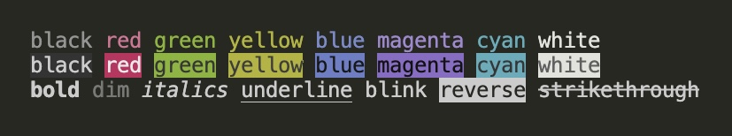

<h1 align="center">
	<p style="text-align: center;font-size: 4rem;">
    <span style="color: black">e</span>
    <span style="color: green">a</span>
    <span style="color: black">s</span>
    <span style="color: blue">y</span>
    <span style="color: yellow">-</span>
    <span style="color: magenta">c</span>
    <span style="color: cyan">h</span>
    <span style="color: black">a</span>
    <span style="color: red">l</span>
    <span style="color: black">k</span>
  </p>
</h1>



## 说明（Illustrate） 
- 欢迎使用终端简单字符串样式定义工具方法 easy-chalk （Welcome to the terminal easy string style definition tool method easy-chalk）

- 代码只有大概1kb，使用非常简单且可靠，支持常用字体颜色（8+8种），背景色（8+8种），样式（8种）的选择定义。

## 安装（Install）
```sh
npm i easy-chalk
# 或者 (Or)
pnpm add easy-chalk
```

## 使用（Usage）
```javascript
import easyChalk, { color, bgColor, style } from 'easy-chalk'

/**
 * 比如打印一个 白色字体，红色背景色，斜体的 log
*/
console.log(easyChalk(
  '欢迎使用 easy-chalk',
  [color.white, bgColor.red, style.italics])
)
```
